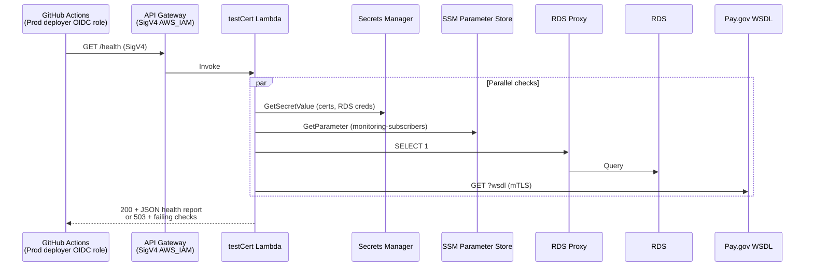

# PAY-350 — Production Post-Deploy Smoke / Health Check *(synthetic, read-only)*

**Ticket:** T1 — Prod post-deploy smoke / health check *(synthetic, read-only)*
**Goal:** After every Prod apply, an automated gate proves the deployed stack is wired correctly — without creating payment state, touching real money, or leaving permanent CI authorization in `client-permissions`.

---

## Executive summary

**Do not uncomment the staging `/init` smoke in Prod.** That path creates a real Pay.gov session and a DB transaction row. It also requires `authorizeClient` (fee-scoped `client-permissions`), which is the wrong security model for a deploy gate.

**Instead:** add a dedicated `GET /health` endpoint that returns structured JSON proving each infrastructure layer, wire it into `prod-deploy.yml` as a hard gate after apply, and document the rollback trigger in existing runbooks.

The Prod deployer role already has ephemeral OIDC credentials and `execute-api:Invoke` on the Prod account API. `/health` does **not** call `authorizeClient`, so you do **not** need to mutate `client-permissions` or build ephemeral grant/revoke machinery — that requirement is satisfied by using a non-fee-scoped route with same-account SigV4.

---

## Architecture

### What each layer proves

| Layer | How it is exercised | Read-only? |
|-------|---------------------|------------|
| **API Gateway** | SigV4-signed `GET /health` reaches the handler | Yes |
| **Lambda** | Handler executes and returns structured JSON | Yes |
| **Secrets Manager** | Read mTLS cert/key (+ passphrase) via `getHttpsAgent()`; read RDS master secret via `getKnex()` | Yes (GetSecretValue only) |
| **RDS (+ Proxy)** | `SELECT 1` through `getKnex()` → proxy → RDS | Yes |
| **SSM** | `GetParameter` on monitoring-subscribers param (proves Parameter Store + KMS decrypt path) | Yes |
| **Pay.gov** | WSDL probe over mTLS (`SOAP_URL?wsdl`) | Yes (no payment APIs) |

### Request flow



### Auth model (addresses "short-lived SigV4")

| Approach | Verdict |
|----------|---------|
| Re-enable commented `/init` smoke | **Reject** — writes DB state, initiates Pay.gov flow, needs fee permissions |
| Add deployer to `client-permissions` permanently | **Reject** — unnecessary blast radius |
| Ephemeral `client-permissions` grant/revoke in workflow | **Reject** — `/health` does not use `authorizeClient` |
| **Same-account OIDC deployer → SigV4 `GET /health`** | **Adopt** — credentials expire with the GH Actions job; no secrets mutation |

The deploying account is already in the API Gateway resource policy (`terraform/modules/api-gateway/main.tf`). The deployer role already has `execute-api:Invoke` (`terraform/modules/iam/role-deployer.tf`).

---

## Phase 0 — Preconditions & decisions (½ day)

### 0.1 Confirm Prod deployer can invoke today

Before writing code, verify in the Prod account (read-only):

```bash
# After aws sso login / assuming prod read-only or deployer
API_URL=$(cd terraform/environments/prod && terraform output -raw api_gateway_url)

# Signed GET /test should return 200 today (WSDL body)
# Use the same curl SigV4 pattern as staging-deploy.yml
```

If this fails with 403, stop and fix IAM/resource-policy before proceeding. The new `/health` route will have identical auth requirements to `/test`.

### 0.2 Lock design decisions (write these in the PR description)

1. **New route:** `GET /health` — do not overload `/test` (WSDL contract + EventBridge probe must stay stable).
2. **Same Lambda:** Route `/health` and `/test` to the existing `testCert` function; branch inside the handler on event shape.
3. **HTTP semantics:**
   - `200` — all checks `ok`
   - `503` — one or more checks failed (body still contains full diagnostics)
   - Never leak secret values — only secret *names*, latencies, and error classes
4. **Gate behavior:** Failed health check **fails the deploy job** → triggers rollback runbook.
5. **Parity:** Ship `/health` to **dev, stg, and prod** so you can validate in Staging before first Prod use.

### 0.3 Foundation IAM change (required for SSM check)

Lambda execution role currently has Secrets Manager access but **no SSM** (`terraform/modules/iam/role-lambda.tf`).

Add to `role-lambda.tf`:

```hcl
{
  Effect   = "Allow"
  Action   = ["ssm:GetParameter"]
  Resource = "arn:aws:ssm:${local.aws_region}:${data.aws_caller_identity.current.account_id}:parameter/ustc/pay-gov/*"
}
```

**Apply path:** foundation networking in **dev, stg, prod** accounts (IAM is account-level). This is a foundation apply, not a per-environment app apply — follow `AGENTS.md` Terraform conventions.

---

## Phase 1 — Application layer (1–1½ days)

### 1.1 Types — `src/types/DeployHealthCheck.ts`

```typescript
export type HealthCheckStatus = "ok" | "failed";

export type HealthCheckResult = {
  status: HealthCheckStatus;
  latencyMs: number;
  error?: string;           // safe, non-PII message
  details?: Record<string, unknown>; // no secret values
};

export type DeployHealthReport = {
  status: "healthy" | "unhealthy";
  environment: string;      // APP_ENV
  timestamp: string;          // ISO-8601
  releaseTag?: string;        // from optional X-Deploy-Tag header
  checks: {
    secrets: HealthCheckResult;
    ssm: HealthCheckResult;
    rds: HealthCheckResult;
    payGov: HealthCheckResult;
  };
};
```

### 1.2 Use case — `src/useCases/runDeployHealthCheck.ts`

**Rules a principal dev would enforce:**

- Accept `AppContext` as first argument (project convention).
- Run checks **in parallel** (`Promise.allSettled`) so one slow dependency does not serially inflate deploy time.
- Each check is a small private function with its own try/catch — never let one throw abort the others.
- **Secrets check:** call `appContext.getHttpsAgent()` (exercises `PRIVATE_KEY_SECRET_ID`, `CERTIFICATE_SECRET_ID`, `CERT_PASSPHRASE_SECRET_ID`). Return `details: { privateKey: true, certificate: true, passphraseConfigured: boolean }`.
- **RDS check:** `const knex = await getKnex(); await knex.raw("SELECT 1 AS ok");` — read-only, no model writes.
- **SSM check:** new thin client `src/clients/ssmClient.ts` with `getParameterString(name: string)` using `@aws-sdk/client-ssm`. Read `process.env.MONITORING_SUBSCRIBERS_PARAMETER_NAME` (new env var — see 1.4). Validate JSON parses to an array; do **not** log subscriber endpoints (PII).
- **Pay.gov check:** reuse WSDL probe logic from `testCert.ts` — extract to `src/health/probePayGovWsdl.ts` so scheduled probe and deploy health share one implementation. Record `httpOk: boolean` and latency; do not return WSDL body in `/health` response.
- Aggregate: `status: "healthy"` only if **all** checks are `ok`; otherwise `"unhealthy"`.
- Total wall time target: **< 15s** (set Jest/workflow timeout to 30s for headroom).

### 1.3 Refactor `src/testCert.ts` — event routing

The handler must support three invocation modes without breaking existing behavior:

| Event shape | Behavior |
|-------------|----------|
| `{ healthProbe: true }` | EventBridge scheduled probe — existing metric emission, return 200/500 with WSDL body |
| API GW `GET /test` | Existing on-demand WSDL response (unchanged) |
| API GW `GET /health` | Call `runDeployHealthCheck`, return JSON |

```typescript
import type { APIGatewayProxyEvent, APIGatewayProxyResult } from "aws-lambda";

type TestCertEvent =
  | { healthProbe?: boolean }
  | APIGatewayProxyEvent;

export const handler = async (
  event?: TestCertEvent,
): Promise<APIGatewayProxyResult | { statusCode: number; body: string }> => {
  // 1. Scheduled probe (no requestContext)
  if (event && "healthProbe" in event && event.healthProbe === true) {
    return handleScheduledProbe();
  }

  // 2. API Gateway
  if (event && "requestContext" in event) {
    const path = event.path ?? event.resource ?? "";
    if (path.endsWith("/health")) {
      return handleDeployHealth(event);
    }
    return handleTestEndpoint(); // existing /test behavior
  }

  // 3. Direct/test invoke without API GW — preserve backward compat
  return handleTestEndpoint();
};
```

`handleDeployHealth` should:
- Read optional `X-Deploy-Tag` header for traceability in logs (not required for pass/fail).
- Log via `appContext.logger.info({ report: sanitizedReport }, "deploy health check")` — ensure no PII in log payload; check `redact.paths` in `src/utils/logger.ts` before adding fields.
- Return `statusCode: report.status === "healthy" ? 200 : 503`.

### 1.4 Environment variable — `MONITORING_SUBSCRIBERS_PARAMETER_NAME`

Add to payment Lambda env in `terraform/environments/{dev,stg,prod}/locals.tf`:

```hcl
MONITORING_SUBSCRIBERS_PARAMETER_NAME = module.secrets.monitoring_subscribers_parameter_name
```

This wires the SSM check to the same parameter Terraform already manages (`terraform/modules/secrets/main.tf`).

### 1.5 Unit tests (coverage ≥ 90% on new code)

| File | What to test |
|------|--------------|
| `src/useCases/runDeployHealthCheck.test.ts` | Each check ok; each check failing independently; parallel failure aggregation; no secret leakage in results |
| `src/clients/ssmClient.test.ts` | Happy path; missing param; SDK error |
| `src/health/probePayGovWsdl.test.ts` | 2xx healthy; non-2xx unhealthy; network error |
| `src/testCert.test.ts` | Extend: `/health` routing returns JSON 200/503; scheduled probe unchanged; `/test` unchanged |

**Coverage decision:** defensive catches around unlikely SDK throws — add tests (these are real failure modes in Prod deploy gate).

### 1.6 OpenAPI — `src/openapi/registry.ts`

Register `GET /health`:
- Security: `sigv4`
- Response `200` / `503` with `DeployHealthReport` schema
- Description: *Synthetic, read-only post-deploy verification. Does not create payment state.*

Run `npm run generate:openapi` and commit the regenerated `docs/openapi.yaml`.

---

## Phase 2 — Infrastructure (½–1 day)

### 2.1 API Gateway — `terraform/modules/api-gateway/main.tf`

Add alongside existing `/test` resources:

1. `aws_api_gateway_resource.health` — path part `health`
2. `aws_api_gateway_method.health_get` — `authorization = "AWS_IAM"`
3. `aws_api_gateway_integration.health_integration` — proxy to `testCert` Lambda (same URI as `/test`)
4. `aws_lambda_permission` for `/*/GET/health` (mirror `/test` permission at line ~596)

Ensure the resource is included in the deployment `depends_on` / stage deployment trigger (same pattern as `/test`).

### 2.2 No new Lambda artifact

`/health` reuses `testCert.zip` — no changes to `build-lambda.sh` artifact list or `prod-deploy.yml` artifact validation loop.

### 2.3 Apply order

1. **Foundation IAM** (SSM on lambda exec role) — all accounts
2. **App Terraform** (API GW route + env var) — dev → validate → stg → validate → prod

---

## Phase 3 — CI/CD integration (½ day)

### 3.1 Integration test — `src/test/integration/deployHealthSmoke.test.ts`

Purpose: the workflow's executable contract. Pattern-match `sigv4Smoke.test.ts`.

```typescript
/**
 * Prod/stg post-deploy health gate.
 * Requires: BASE_URL, AWS credentials with execute-api:Invoke.
 * Does NOT require client-permissions registration.
 */
describe("GET /health deploy gate", () => {
  it("returns 200 with all checks ok", async () => {
    const result = await signedFetch(`${baseUrl}/health`, { method: "GET" });
    const body = await result.json();
    console.log("HEALTH_STATUS=", result.status, JSON.stringify(body, null, 2));
    expect(result.status).toBe(200);
    expect(body.status).toBe("healthy");
    for (const check of Object.values(body.checks)) {
      expect(check).toMatchObject({ status: "ok" });
    }
  });

  it("unsigned GET /health returns 403", async () => {
    const result = await fetch(`${baseUrl}/health`);
    expect(result.status).toBe(403);
  });
});
```

### 3.2 npm script — `package.json`

```json
"test:deploy-health": "BASE_URL=$BASE_URL npx jest ./src/test/integration/deployHealthSmoke.test.ts --verbose"
```

### 3.3 `prod-deploy.yml` — replace commented block

Insert **after** `Get Terraform Outputs`, **only when apply ran** (keep existing `if` guard):

```yaml
      - name: Setup Node (post-deploy health check)
        if: ${{ ((github.event_name == 'release' && github.event.release.prerelease == false) || (!inputs.plan_only)) && steps.tf_plan.outputs.exitcode == '2' }}
        uses: actions/setup-node@v6
        with:
          node-version-file: .nvmrc
          cache: npm

      - name: Install dependencies (post-deploy health check)
        if: ${{ ((github.event_name == 'release' && github.event.release.prerelease == false) || (!inputs.plan_only)) && steps.tf_plan.outputs.exitcode == '2' }}
        run: npm ci

      - name: Post-deploy health check (synthetic, read-only)
        if: ${{ ((github.event_name == 'release' && github.event.release.prerelease == false) || (!inputs.plan_only)) && steps.tf_plan.outputs.exitcode == '2' }}
        env:
          BASE_URL: ${{ steps.tf_outputs.outputs.api_url }}
          AWS_REGION: ${{ env.AWS_REGION }}
          DEPLOY_TAG: ${{ needs.promote.outputs.tag }}
        run: |
          set -euo pipefail
          trap 'echo "::error::Post-deploy health check FAILED"; exit 1' ERR

          echo "Running post-deploy health check against: $BASE_URL"
          echo "Release tag: $DEPLOY_TAG"

          # Optional: pass tag for log correlation (handler reads X-Deploy-Tag)
          export HEALTH_EXTRA_HEADERS="X-Deploy-Tag: $DEPLOY_TAG"

          npm run test:deploy-health

          echo "Post-deploy health check PASSED"

      - name: Upload health check diagnostics on failure
        if: ${{ failure() && steps.tf_outputs.outputs.api_url != '' }}
        uses: actions/upload-artifact@v6
        with:
          name: prod-deploy-health-failure-${{ github.run_id }}
          path: |
            health-check.log
          retention-days: 30
          if-no-files-found: ignore
```

**Enhancement for diagnostics:** in the test file or a small `scripts/run-deploy-health-check.js` wrapper, on failure write `health-check.log` containing:
- `BASE_URL`, `DEPLOY_TAG`, timestamp
- Full JSON response body
- Per-check status table
- Link template: CloudWatch log group `/aws/lambda/ustc-payment-portal-prod-testCert` (from terraform output)

Use `tee health-check.log` in the workflow `run` block.

### 3.4 Optional but recommended — Staging parity

Add the same step to `staging-deploy.yml` **after** the existing `/init` smoke (not replacing it). Staging gets both:
- `/init` smoke — payment-path integration
- `/health` smoke — deploy-health contract you'll rely on in Prod

This lets you burn in `/health` before first Prod release.

### 3.5 When health check should NOT run

| Scenario | Run health? |
|----------|-------------|
| `plan_only=true` | No |
| Terraform plan exit code 0 (no changes) | No (apply skipped — nothing new deployed) |
| Terraform plan exit code 1 (error) | No (job already failed) |
| Successful apply (exit code 2) | **Yes — hard gate** |

---

## Phase 4 — Documentation & runbooks (½ day)

Update these files (same PR or immediate follow-up — do not leave docs stale):

### 4.1 `docs/runbooks/deploy/deploy-post-golive.md`

- Replace "manual post-deploy verification required" with "automated `/health` gate in `prod-deploy.yml`"
- Update the gate table: Prod hard gate = **Terraform plan review + `/health` 200**
- Add troubleshooting section:

| Symptom | Likely cause | Action |
|---------|--------------|--------|
| `checks.secrets.failed` | Secrets Manager/KMS/mTLS cert issue | Check cert secret rotation, lambda IAM |
| `checks.rds.failed` | RDS Proxy, security group, or secret | Check proxy target health, lambda SG |
| `checks.ssm.failed` | Missing IAM or parameter | Verify foundation lambda IAM applied |
| `checks.payGov.failed` | NAT/EIP allowlist, Pay.gov outage | Check Pay.gov composite alarm runbook |
| 403 on health check | Deployer lacks invoke or wrong account | Check OIDC role, API resource policy |

### 4.2 `docs/runbooks/deploy/deploy-rollback.md`

- Update row: "Prod healthy-check failed after apply" → now **automated**; workflow failure is the signal
- Add: "Do not dismiss a red health gate — roll back per Axis A unless migration in release"

### 4.3 `docs/runbooks/deploy/deploy-pre-golive.md`

- Remove "Known gap: Prod has no post-deploy smoke test"
- Add `/health` to Prod stage description

### 4.4 `docs/deploy-backlog.md`

- Mark T1 complete / remove item (per file's own guidance once ticket is filed and done)

### 4.5 `AGENTS.md` — no change required unless you add a new npm script convention worth documenting

---

## Phase 5 — Validation checklist (before merging)

### Local / Dev

- [ ] `npm run tsc` clean
- [ ] `npm run lint` clean
- [ ] `npm test` — unit coverage ≥ 90%
- [ ] `npm run test:coverage` — no regression on touched files

### Deployed Dev (via `cicd-dev.yml` or manual)

- [ ] `GET /health` unsigned → 403
- [ ] `GET /health` signed → 200, all checks `ok`
- [ ] `GET /test` still returns WSDL (no regression)
- [ ] EventBridge scheduled probe still emits `PayGovHealthy` metric (check CloudWatch after 15 min)

### Staging (mandatory burn-in)

- [ ] Deploy to Staging with `/health` step enabled
- [ ] Intentionally break one check in a throwaway branch (e.g. wrong `SOAP_URL` in a PR env) — confirm 503 + actionable JSON
- [ ] Confirm no rows created in `transactions` table from health check (SQL read-only verification)

### Prod (first release with this change)

- [ ] Foundation IAM applied in Prod account **before** app deploy that includes `/health`
- [ ] Run `prod-deploy.yml` with `plan_only=true` first — confirm plan shows only expected deltas
- [ ] Real release apply — watch health step in Actions
- [ ] Confirm deploy job fails loudly if you temporarily break health in Staging (prove the gate works)

---

## Acceptance criteria traceability

| AC | How it's met |
|----|--------------|
| After Prod deployment, smoke test runs on recently deployed environment | `prod-deploy.yml` step after successful apply, uses `steps.tf_outputs.outputs.api_url` |
| Touches API GW, Lambda, RDS, Secrets, Pay.gov (and SSM) | `runDeployHealthCheck` exercises each layer; SigV4 call exercises API GW |
| Outputs status code + debugging info | HTTP 200/503 + JSON `checks.*` with latencies and safe error messages; artifact upload on failure |
| Synthetic, read-only | No `/init`, no `/process`, no DB writes; `SELECT 1` only |
| Short-lived SigV4 | OIDC session creds; no `client-permissions` mutation |

---

## File change manifest

| File | Action |
|------|--------|
| `src/types/DeployHealthCheck.ts` | **Add** |
| `src/clients/ssmClient.ts` | **Add** |
| `src/health/probePayGovWsdl.ts` | **Add** (extract from testCert) |
| `src/useCases/runDeployHealthCheck.ts` | **Add** |
| `src/testCert.ts` | **Modify** — routing |
| `src/test/integration/deployHealthSmoke.test.ts` | **Add** |
| `src/openapi/registry.ts` | **Modify** |
| `docs/openapi.yaml` | **Regenerate** |
| `terraform/modules/iam/role-lambda.tf` | **Modify** — SSM read |
| `terraform/modules/api-gateway/main.tf` | **Modify** — `/health` route |
| `terraform/environments/{dev,stg,prod}/locals.tf` | **Modify** — env var |
| `.github/workflows/prod-deploy.yml` | **Modify** — enable gate |
| `.github/workflows/staging-deploy.yml` | **Modify** (recommended) |
| `package.json` | **Modify** — script |
| `docs/runbooks/deploy/*.md` | **Modify** |
| `docs/deploy-backlog.md` | **Modify** — close T1 |

**Do not modify:** commented `/init` block in `prod-deploy.yml` — leave it commented with a one-line comment: `# Use GET /health instead — /init creates payment state (unsafe for Prod).`

---

## PR structure (how a principal dev ships it)

**One PR, logical commits (developer commits manually):**

1. `feat(health): add runDeployHealthCheck use case and /health routing`
2. `feat(terraform): expose GET /health and lambda SSM access`
3. `ci(prod): gate deploy on post-deploy health check`
4. `docs: update deploy runbooks for automated prod verification`

**PR description must include:**
- Explicit statement: no Pay.gov payment APIs called
- Foundation apply required before app deploy
- Staging burn-in evidence (screenshot or Actions link)
- Rollback instruction on red gate

---

## Risk register

| Risk | Mitigation |
|------|------------|
| Health check passes but payment flow broken | Staging still runs `/init` smoke; T2 (full integration suite) remains separate backlog item |
| Lambda cold start + RDS prewarm causes timeout | 30s workflow timeout; parallel checks; `getKnex` already prewarmed in `lambdaHandler.ts` — add same prewarm line in `testCert.ts` for `/health` path |
| SSM check logs PII (phone numbers in subscribers) | Parse array length only; never log `endpoint` values |
| Foundation IAM not applied before app deploy | Document in PR; gate staging deploy on foundation first |
| `/health` accidentally requires `authorizeClient` | Code review: use case must not import `authorizeClient` |

---

## Estimated execution time

| Phase | Duration |
|-------|----------|
| 0 — Preconditions | 2–4 hours |
| 1 — Application | 1–1.5 days |
| 2 — Terraform | 0.5–1 day (incl. foundation applies) |
| 3 — CI/CD | 0.5 day |
| 4 — Docs | 0.5 day |
| 5 — Staging burn-in | 0.5 day |
| **Total** | **~3–4 dev days** |

---

## Definition of done

- [ ] `prod-deploy.yml` runs automated `/health` gate after every Prod apply
- [ ] Gate failure fails the workflow with structured diagnostics
- [ ] All AC layers verified in JSON response
- [ ] No payment state created; no `client-permissions` changes
- [ ] Unit + integration tests green; coverage ≥ 90%
- [ ] Runbooks updated; deploy backlog T1 closed
- [ ] Staging burn-in complete before first Prod use
