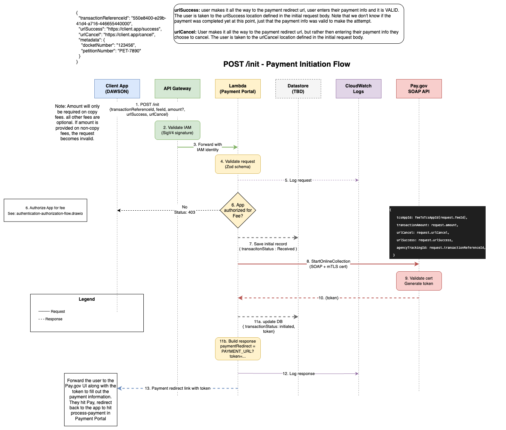
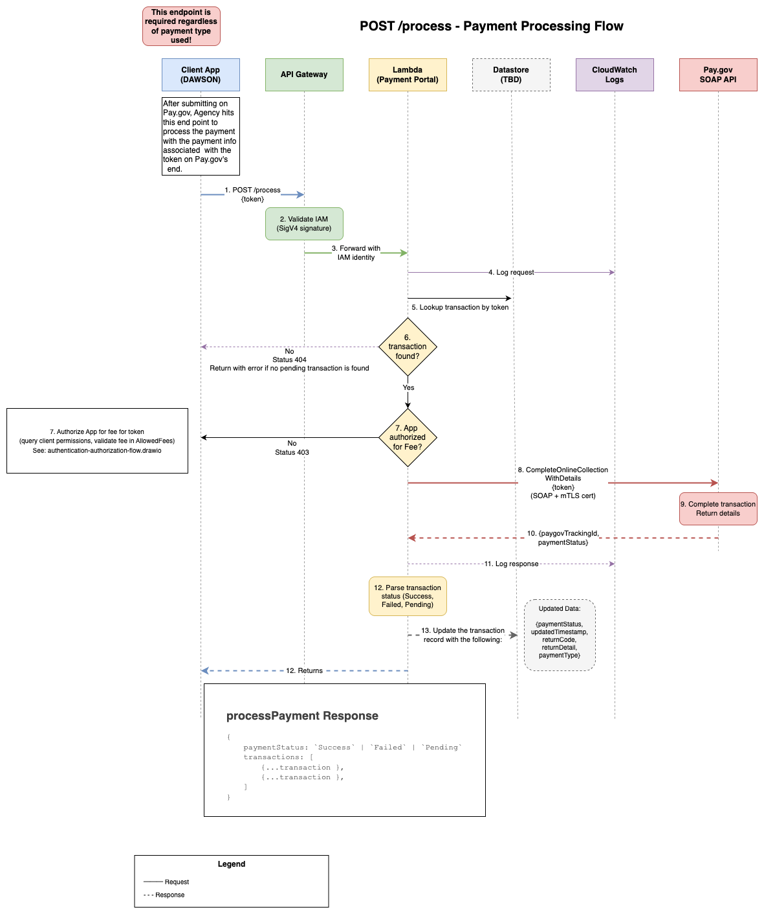
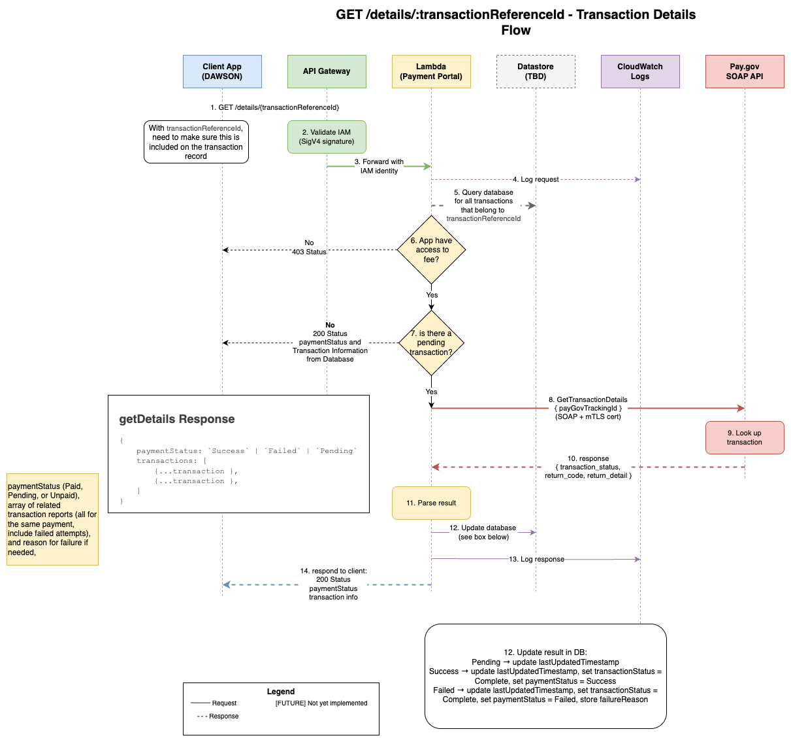

# USTC Payment Portal

This package makes SOAP requests to the pay.gov hosted collection pages service.

The application is intended to handle API requests from USTC applications and then make requests to Pay.gov on its behalf.

## Workflow

### Current workflow (v1)

**NOTE:** This workflow will be deprecated as we work towards a new version that will better serve Apps that rely on payments that are paid via Pay.gov, and therefore will need to rely on the Payment Portal. See below for the workflow that we are building for the future.

1. An application makes a request to initiate a transaction the Payment Portal.
2. The portal then performs a `startOnlineCollection` request to Pay.gov with the transaction information.
3. Pay.gov responds with a token, which the portal uses to generate a redirect URL to Pay.gov to enter in payment information.
4. The token and URL are returned to the original App, which stores the token and forwards the user to the redirect URL.
5. The user enters their payment information or cancels, which sends them back to the success or cancel URL specified in the original request.
6. Once back on the originating app, the app makes another request to the Payment Portal to process the transaction.
7. The payment portal calls Pay.gov to perform a `completeOnlineCollection` with the token.
8. Pay.gov responds with a Tracking ID, which is relayed back to the App via the Portal.

### Future workflow (v2)

This workflow is currently a work-in-progress and not operational yet. We'll post more information to this documentation as we work towards getting it ready to use.

#### Initiate a Transaction

1. An application makes a request to initiate a transaction to the Payment Portal. This request includes some key information:

   - **FeeId**: The unique identifier of the Fee the Application wishes to charge. The Portal will maintain a list of identifiers that can be used.
   - **TransactionReferenceId**: A unique identifier generated by the Application to use in future API calls that refer back to the specific thing the User is paying for (e.g., a DAWSON Petitions Fee for Docket Number 123-12). This must be a [UUID](https://en.wikipedia.org/wiki/Universally_unique_identifier).
   - **AppId**: The unique identifier in the Portal for each Application. This may be achieved through AWS Signature Version 4 authentication, and may not need to be required.
   - **Metadata**: This is a Key/Value object. Different fees will require values for specific keys. For example, `{ "DocketNumber": "123-12" }` may be used for a Petitions Fee payment request.

1. The Portal authenticates the application via AWS Signature Version 4
1. The Portal checks its own permission system to authorize the Application to initiate a Transaction to the Specified Fee
1. Once authorized, the Portal also makes sure there is not already a Successful transaction for the specified `TransactionReferenceId`.
1. If there isn't, then the Portal generates a unique `agencyTrackingId`
   and starts keeping track of this transaction in its own database.
1. The portal then performs a `startOnlineCollection` request to Pay.gov with the transaction information derived from the Fee.
1. Pay.gov responds with a token, which the portal uses to generate a redirect URL to Pay.gov to enter in payment information.
1. The token and URL are returned to the original App, which stores the token and forwards the user to the redirect URL.
1. The user enters their payment information on Pay.gov and either submits or cancels, which sends them back to the corresonding success or cancel URL specified in the original request.


[init-payment-flow.drawio](./docs/diagrams/init-payment-flow.drawio)

#### Process Payment on a Transaction

1. Once back on the originating app, the app makes another request to the Payment Portal to process the transaction with the `token`
1. Once authenticated, the Portal makes sure the App has the authority to process transactions for the Fee of the transaction that is associated with the `token`.
1. Once authorized, the payment portal calls Pay.gov to perform a `completeOnlineCollectionWithDetails` with the token.
1. Pay.gov responds with a Pay.gov Tracking ID for future, Transaction Status
1. The Portal updates the transaction information in the database
1. The Portal responds to the Application the derived Payment Status as well as any transactions that share the transaction's `transactionReferenceId`.


[process-payment-flow.drawio](./docs/diagrams/process-payment-flow.png)

#### Get Details about a Payment

1. At any time the App may request information for their unique `transactionReferenceId` by calling the `getDetails` API.
1. Once authenticated, the Portal ensures the App has access to the Fee that is associated with the specified `transactionReferenceId`.
1. And once authorized, the Portal checks to see if there is a transaction with a `Pending` status. If so, the Portal will call Pay.gov with `getDetails` to see if the transaction status has resolved, updating its database accordingly.
1. Then the Portal will respond with the most up-to-date Payment Status as well as any transactions that share the transaction's `transactionReferenceId`.


[get-details-flow.drawio](./docs/diagrams/get-details-flow.png)

## Environment Variables

Environment variables are located in `.env.<NODE_ENV>`.

Stages should be one of `dev`, `stg`, and `prod`. The dev server should be configured to point to the USTC Pay.gov test server, which is managed in a [separate repository](https://github.com/ustaxcourt/ustc-pay-gov-test-server).

| Environment Variable | Description                                                                                                      |
| -------------------- | ---------------------------------------------------------------------------------------------------------------- |
| `API_ACCESS_TOKEN`   | An optional token that is used to make authorized requests to the development portal                             |
| `BASE_URL`           | The URL of this payment portal (for running integration tests)                                                   |
| `CERT_PASSPHRASE`    | The secret password for using the certificate as an httpsAgent                                                   |
| `NODE_ENV`           | The environment or stage for this application (`staging`, `development`, or `production`)                        |
| `PAYMENT_URL`        | The URL of the Payment UI where the user is forwarded once a transaction request has been successfully initiated |
| `SOAP_URL`           | The URL of the SOAP Server that handles payment requests made by this portal                                     |
| `SUBDOMAIN`          | The subdomain that the deployed application should assume                                                        |
| `TCS_APP_ID`         | The identifier granted by Pay.gov for using their service (used for testing)                                     |

## Deployment

This gets deployed to the USTC Website AWS Account using Terraform. You will need credentials loaded in order to perform this operation. And you will need the above environment variables specified.

See the `terraform/` directory for deployment configuration and instructions.

## Testing

Right now there aren't many unit tests, but there are some integration tests that test the deployed application at the base url and the apiToken specified in `.env.dev`:

```bash
npm run test
```

## Publishing to npmjs.org

This package is published to npmjs.org as `@ustaxcourt/payment-portal` and can be installed via:

```bash
npm install --save-dev @ustaxcourt/payment-portal
```

### Publishing Process

1. **Make changes** on a feature branch
2. **Add a changeset** to document your changes:
   ```bash
   npx changeset add
   ```
   - Select the package and bump type (patch/minor/major)
   - Write a concise summary for the changelog
3. **Open a PR** and merge to `main`
4. **Review and merge** the "Version Packages" PR that Changesets automatically creates
5. **Automatic publish** via GitHub Actions to npm with provenance

For detailed instructions, see [PUBLISHING.md](./PUBLISHING.md).
