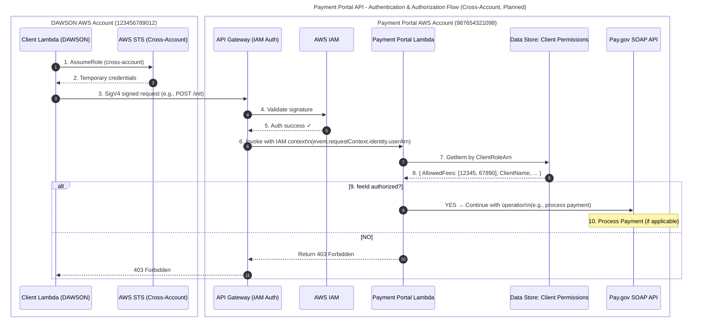

# Payment Portal API — Authentication & Authorization Flow (Cross‑Account, Planned)

This document describes how a **client service in the DAWSON AWS account** calls the **Payment Portal** running in a separate AWS account using **cross‑account IAM**, **SigV4‑signed requests**, and **fee‑level authorization** enforced by the Payment Portal.

***

## High‑Level Architecture

*   **DAWSON AWS Account (123456789012)**
    *   **Client Lambda (DAWSON)**
    *   **Client IAM Role** (tags identify the client and allowed app IDs)

*   **Payment Portal AWS Account (987654321098)**
    *   **API Gateway** (IAM auth, cross‑account allowed by resource policy)
    *   **Payment Portal Lambda** (authorizes requests using IAM context)
    *   **Data Store: Client Permissions** (maps client identity → allowed fees)
    *   **External**: Pay.gov SOAP API (accessed by the Portal)

***

## End‑to‑End Flow

1.  **Client assumes cross‑account role**\
    The DAWSON client function assumes a Payment Portal–trusted role (or a local role that has permission to call the Portal), acquiring **temporary credentials** via **AWS STS AssumeRole**.

2.  **Receive temporary credentials**\
    STS returns a time‑limited access key, secret, and session token.

3.  **Client sends SigV4‑signed request**\
    Using the temporary credentials, the client sends a **SigV4‑signed** API request (e.g., `POST /init`, `POST /process`, `GET /details/...`) to the Portal **API Gateway**.

4.  **API Gateway validates signature (IAM)**\
    Gateway delegates signature validation to **AWS IAM**.

5.  **Auth success → continue**\
    If the signature and policy checks pass, control returns to API Gateway.

6.  **Gateway invokes Payment Portal Lambda**\
    The invocation includes IAM context (e.g., `event.requestContext.identity.userArn`).

7.  **Portal queries client permissions**\
    The Lambda **loads the permissions record** for the client from its **Data Store** using an identifier derived from the caller’s IAM principal/role ARN.

8.  **Return allowed fee list**\
    The Data Store returns (e.g.) `AllowedFees: [12345, 67890]` and other metadata (client name/account).

9.  **Authorize**\
    The Portal checks: “Is the requested `feeId` authorized for this client?”
    *   **YES** → proceed with the requested operation (e.g., call Pay.gov).
    *   **NO** → **403 Forbidden**.

10. **Process Payment (if applicable)**\
    When authorized, the Payment Portal proceeds with the relevant operation (e.g., `StartOnlineCollection`, `CompleteOnlineCollectionWithDetails`, or data retrieval for `/details`).

***

## Mermaid — Sequence Diagram



***

## IAM & API Gateway Concepts (what is stored/used)

### Client IAM Role (in DAWSON account)

*   **Example metadata** (captured by **tags**; values inform your portal who is calling):
    *   `ClientName: DAWSON`
    *   `AllowedTcsAppIds: "12345,67890"`

> The Payment Portal generally identifies the caller by the **IAM Role ARN** seen in `userArn`.

### Data Store — Client Permissions (in Portal account)

**Canonical record (from the diagram text):**

```json
{
  "ClientRoleArn": "arn:aws:iam::123456789012:role/payment-portal-client-dawson",
  "ClientAccountId": "123456789012",
  "ClientName": "DAWSON",
  "AllowedFees": [12345, 67890]  // fee IDs authorized for this client
}
```

*   **Primary lookup key**: `ClientRoleArn` (recommended to avoid ambiguity)
*   Optionally also maintain: `AllowedTcsAppIds`, environment, contact, etc.

***

## Authorization Check in the Lambda

1.  Extract the caller’s principal from `event.requestContext.identity.userArn`.
2.  Lookup permissions record in the Data Store using that ARN.
3.  Verify the incoming `feeId` is **in** `AllowedFees`.
4.  If **not authorized** → **403 Forbidden**.
5.  If authorized → proceed with the requested business action (init/process/details).

***

## Example Snippets (for reference)

> **NOTE:** These are illustrative. Tailor to your org’s naming and security baselines.

### 1) API Gateway Resource Policy (allow cross‑account callers)

```jsonc
{
  "Version": "2012-10-17",
  "Statement": [
    {
      "Sid": "AllowDawsonAccountInvoke",
      "Effect": "Allow",
      "Principal": { "AWS": "arn:aws:iam::123456789012:root" },
      "Action": "execute-api:Invoke",
      "Resource": "arn:aws:execute-api:REGION:987654321098:apiId/*/*/*"
    }
  ]
}
```

### 2) Lambda Execution (extract caller & check fee)

```ts
// Pseudo/TypeScript-style for clarity
export async function handler(event: any) {
  const userArn: string = event?.requestContext?.identity?.userArn ?? "";
  const feeId: number = Number(JSON.parse(event.body).feeId);

  // 7) Lookup permissions
  const perms = await permissionsStore.getByClientRoleArn(userArn);
  if (!perms) return forbidden("Unknown caller");

  // 9) Authorize fee
  if (!perms.AllowedFees?.includes(feeId)) {
    return forbidden("App is not authorized for this fee");
  }

  // 10) Continue with the specific operation (init/process/details)
  // ...
}

function forbidden(message: string) {
  return { statusCode: 403, body: JSON.stringify({ error: "Forbidden", message }) };
}
```

***

## Operational Notes

*   **Cross‑Account Trust**: If the DAWSON client uses **AssumeRole**, ensure the **trust policy** and **permissions policy** allow the intended use and limit privilege to only the needed API actions.
*   **Keying Strategy**: Using the exact **caller role ARN** as the Data Store primary key ensures you can revoke or rotate roles without ambiguity.
*   **Drift Detection**: Set up monitoring to alert on 403 spikes (could indicate perms drift or mis‑tagged roles).
*   **Auditing**: Log `userArn`, `feeId`, and decision outcomes (allow/deny) to support audits.

***

## Legend

*   **Client Application** — DAWSON (blue)
*   **Portal Service** — Payment Portal (green)
*   **AWS Service** — STS/IAM (yellow)
*   **External Service** — Pay.gov (red)
*   **API Gateway** — (purple)
*   **Decision** — Authorization check (orange)
*   **Solid arrow** — Request
*   **Dashed arrow** — Response

***

## Cross‑Links

*   See **Init Payment Flow**: `POST /init` — token generation and redirect.
*   See **Process Payment Flow**: `POST /process` — complete and finalize payment.
*   See **Get Details Flow**: `GET /details/:appId/:payGovTrackingId` — consolidate status and attempts.
