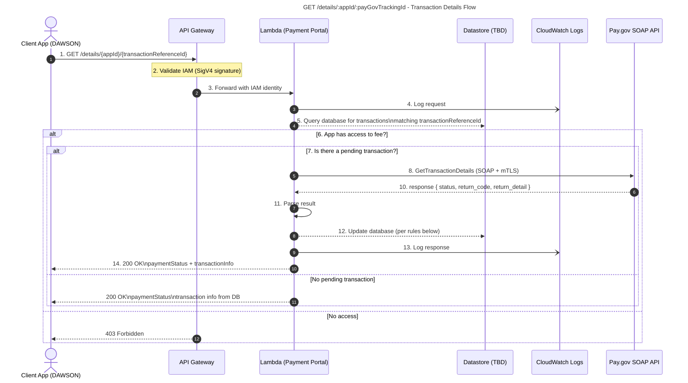

# GET `/details/:appId/:payGovTrackingId`

## Transaction Details Flow

This document describes the end‑to‑end workflow for retrieving transaction details from the Payment Portal, Pay.gov SOAP API, and the backing datastore. It corresponds to the architecture diagram provided.

***

## **Overview**

The **Client App (DAWSON)** requests transaction details via the API Gateway.\
The **Lambda (Payment Portal)** performs access checks, queries the datastore, optionally calls **Pay.gov SOAP API** when needed, updates transaction records, logs activity, and returns a structured response back to the client.

The process also includes:

*   IAM signature validation (SigV4)
*   Conditional logic based on app access rights
*   Conditional lookup for pending transactions
*   Logging to CloudWatch
*   Transaction update rules after receiving Pay.gov results

***

# **1. Sequence Flow (Mermaid Diagram)**




***

# **2. Detailed Step‑by‑Step Description**

### **1. Request Initiation**

The client makes:

    GET /details/{appId}/{transactionReferenceId}

The transactionReferenceId **must be included** in the stored transaction record for lookup.

### **2. API Gateway Validation**

*   Gateway validates SigV4 IAM signature.
*   If invalid → **403**.

### **3. Forward Request**

Gateway forwards the request to the Lambda with IAM identity context.

### **4. Log Request**

Lambda logs the inbound request parameters to CloudWatch Logs.

### **5. Query Datastore**

Lambda queries the database for **all transactions** belonging to the given `transactionReferenceId`.

***

# **3. Decision Logic**

### **Decision A: Does the app have access to the fee?**

*   **No → 403 Status**
*   **Yes → Continue**

### **Decision B: Is there a pending transaction?**

If **no pending transaction**\
→ Return **existing DB results** immediately (200 OK).

If **yes**\
→ Call Pay.gov SOAP API.

***

# **4. Pay.gov SOAP Request**

### **8. GetTransactionDetails**

Lambda calls:

    GetTransactionDetails(payGovTrackingId)

Transport: **SOAP over mTLS certificate**

### **10. Pay.gov Response**

Returns:

*   `transaction_status`
*   `return_code`
*   `return_detail`

### **11. Parse Result**

Lambda normalizes data into internal models.

***

# **5. Database Update Logic (Step 12)**

After receiving Pay.gov results:

| Pay.gov Result | DB Updates                                                                                                              |
| -------------- | ----------------------------------------------------------------------------------------------------------------------- |
| **Pending**    | Update `lastUpdatedTimestamp` only                                                                                      |
| **Success**    | Update `lastUpdatedTimestamp`<br/>`transactionStatus = Complete`<br/>`paymentStatus = Success`                          |
| **Failed**     | Update `lastUpdatedTimestamp`<br/>`transactionStatus = Complete`<br/>`paymentStatus = Failed`<br/>Store `failureReason` |

***

# **6. Final Response to Client**

### **14. 200 OK Response**

```json
{
  "paymentStatus": "Success" | "Failed" | "Pending",
  "transactions": [
    { ...transaction },
    { ...transaction }
  ]
}
```

Notes:

*   `paymentStatus` represents overall final status.
*   `transactions` includes **all attempts** (successful or failed) for the same payment.
*   Failed attempts include error codes and failure reasons.

***

# **7. Legend**

*   **Solid arrow** → Request
*   **Dashed arrow** → Response
*   **\[FUTURE]** → Not yet implemented
