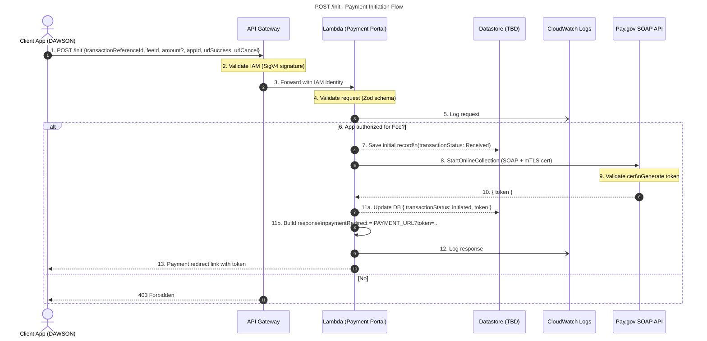

# POST `/init` — Payment Initiation Flow

This document describes how the **Client App (DAWSON)** initiates a payment via the **API Gateway** and **Lambda (Payment Portal)**, persists a preliminary transaction record, calls **Pay.gov SOAP API** to start the collection, and returns a **payment redirect URL (with token)** to the client.

***

## Overview

*   **Security:** API Gateway validates **IAM SigV4**.
*   **Validation:** Lambda validates payload (e.g., with Zod schema).
*   **Authorization:** Lambda verifies the app is authorized for the target **fee**.
*   **Persistence:** Lambda writes an initial transaction record and later updates it with the **token**.
*   **External call:** Lambda calls **Pay.gov StartOnlineCollection** (SOAP over **mTLS**).
*   **User flow:** Client redirects user to Pay.gov using the token; user completes (or cancels) payment and is redirected back to the client app.

***

## Sequence (Mermaid)




***

## Request

### Endpoint

    POST /init

### Headers

*   `Authorization`: SigV4 (IAM)
*   `Content-Type`: `application/json`

### Body (canonical)

```json
{
  "appId": "DAWSON",
  "transactionReferenceId": "550e8400-e29b-41d4-a716-446655440000",
  "feeId": "FEE_CODE",
  "amount": 123.45,               // Optional for most fees; REQUIRED for copy fees
  "urlSuccess": "https://client.app/success",
  "urlCancel": "https://client.app/cancel",
  "metadata": {
    "docketNumber": "123456",
    "petitionNumber": "PET-7890"
  }
}
```

> **Note on `amount`:**
>
> *   **Required** only for **copy fees**.
> *   **Optional** for all other fees.
> *   If `amount` is provided for a **non‑copy fee**, the request is **invalid**.

***

## Validation

*   **IAM SigV4** must be valid; otherwise **403**.
*   Payload (e.g., Zod schema) validates:
    *   `appId` (string, required)
    *   `transactionReferenceId` (UUID/string, required)
    *   `feeId` (string, required)
    *   `amount` (number, **required for copy fees**, otherwise disallowed/optional per fee rules)
    *   `urlSuccess`, `urlCancel` (URLs, required)
    *   `metadata` (object, optional; stored as-is)

***

## Authorization

**“App authorized for Fee?”**

*   If **No** → **403 Forbidden**.
*   If **Yes** → continue.

(Reference: “authentication-authorization-flow\.drawio” in your repo for the detailed auth flow.)

***

## Datastore Writes

1.  **Initial record** (step 7):
    ```json
    {
      "transactionReferenceId": "...",
      "appId": "DAWSON",
      "feeId": "FEE_CODE",
      "status": "Received",
      "createdAt": "<timestamp>",
      "metadata": { ... }
    }
    ```

2.  **After token received** (step 11a):
    ```json
    {
      "transactionReferenceId": "...",
      "status": "Initiated",
      "token": "<paygov_token>",
      "lastUpdatedTimestamp": "<timestamp>"
    }
    ```

***

## Pay.gov Interaction

*   **Operation:** `StartOnlineCollection`
*   **Transport:** SOAP over **mTLS** (client cert)
*   **Input mapping (example):**
    ```jsonc
    {
      "tcsAppId": "<request.appId>",
      "transactionAmount": "<request.amount>",
      "urlCancel": "<request.urlCancel>",
      "urlSuccess": "<request.urlSuccess>",
      "agencyTrackingId": "<request.transactionReferenceId>"
    }
    ```
*   **Response:** `{ "token": "..." }`

***

## Response

**HTTP 200**

```json
{
  "paymentRedirect": "https://pay.gov/ui?token=..."
}
```

**Behavior:**

*   Client should **redirect user** to the `paymentRedirect` URL.
*   User completes UI on Pay.gov and is then redirected:
    *   **`urlSuccess`**: user entered valid payment details (attempt created). This does **not** guarantee the payment settled yet.
    *   **`urlCancel`**: user reached Pay.gov but chose to cancel.

**HTTP 403**

```json
{
  "error": "Forbidden",
  "message": "App is not authorized for the specified fee or IAM signature invalid."
}
```

***

## Logging

*   **Step 5:** Log request (parameters, appId, feeId, referenceId; no secrets).
*   **Step 12:** Log response (token issuance event + redirect construction).
*   All logs go to **CloudWatch Logs**.

***

## Edge Cases & Notes

*   **Idempotency:** If the same `transactionReferenceId` is retried before completion, you may choose to return the **existing token** and status, or create a new attempt based on business rules. (Current diagram suggests single “initiation” per reference; document your policy if multiple attempts are allowed.)
*   **Validation errors:** Use 400 with a structured error payload; the diagram focuses on 403 and happy path, but 400s are expected for schema violations and amount rule violations.
*   **Token TTL:** Ensure you document token expiration and client retry guidance (not shown in the diagram; add to spec if applicable).

***

## Legend

*   **Solid arrow** → Request
*   **Dashed arrow** → Response / data return
*   **\[TBD]** → Component/technology placeholder
