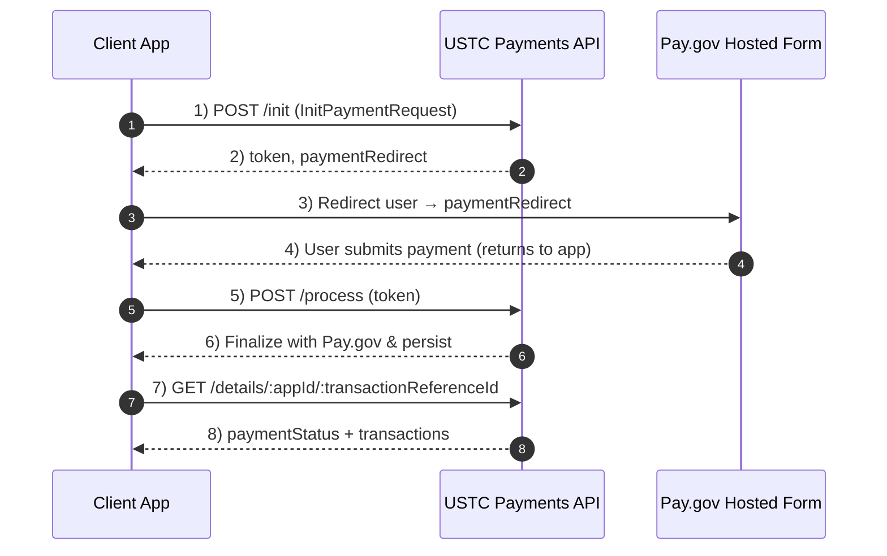
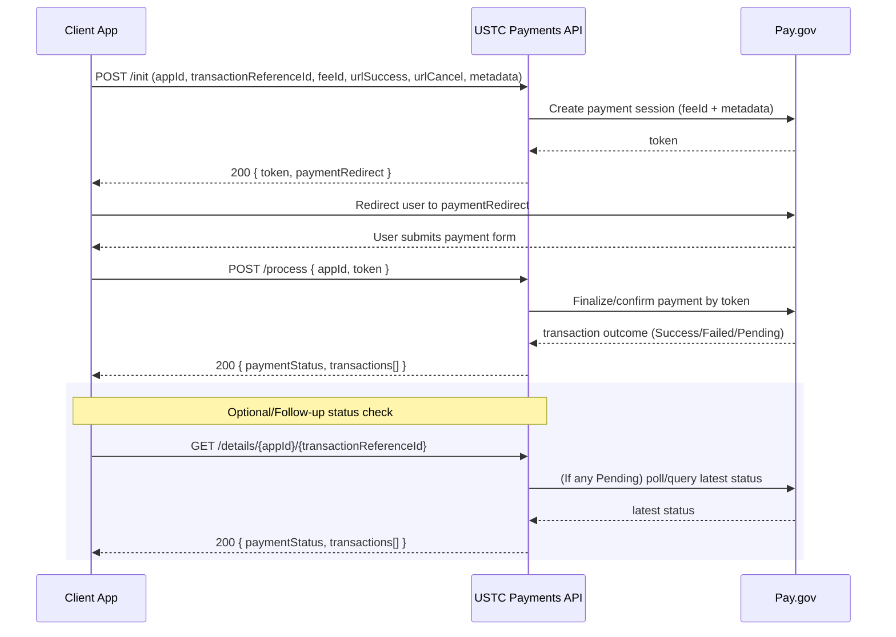

# USTC Payment Portal API

This document captures the end-to-end interaction flow inferred from the provided OpenAPI 3.1 spec. It includes a high-level process flow, a sequence diagram, request/response shapes, and status transitions.

---
## 1) High-Level Flow



**Key points**
- **POST `/init`**: Creates a Pay.gov payment session and returns `token` + `paymentRedirect`.
- **User is redirected to Pay.gov** to enter payment details.
- **POST `/process`**: Must be called **after** the user submits on Pay.gov, regardless of payment method or outcome, to finalize the transaction. Returns **HTTP 200** whether success or failure; check body.
- **GET `/details/{appId}/{transactionReferenceId}`**: Returns current `paymentStatus` and the list of `transactions`. If any transaction is **Pending**, the service queries Pay.gov for latest status before responding.

---
## 2) Sequence Diagram (Happy Path + Status Refresh)



---
## 3) Endpoints & Payloads (from spec)

### 3.1 `POST /init`
**Purpose**: Initialize a payment session; obtain `paymentRedirect` URL for Pay.gov.

- **Auth**: AWS **SigV4** via `Authorization` header; include `X-Amz-Date` and optionally `X-Amz-Security-Token`.
- **Request (InitPaymentRequest)**
```json
{
  "appId": "DAWSON",
  "transactionReferenceId": "550e8400-e29b-41d4-a716-446655440000",
  "feeId": "PETITIONS_FILING_FEE",
  "urlSuccess": "https://client.app/success",
  "urlCancel": "https://client.app/cancel",
  "metadata": { "docketNumber": "123-26" }
}
```
- **Response (200 - InitPaymentResponse)**
```json
{
  "token": "abc123token",
  "paymentRedirect": "https://pay.gov/payment?token=abc123token&tcsAppID=USTC_APP"
}
```
- **Errors**: 400 (validation), 403 (auth), 500 (server)

**Notes**
- `metadata` shape depends on `feeId`:
  - `PETITIONS_FILING_FEE` → `{ docketNumber }`
  - `NONATTORNEY_EXAM_REGISTRATION` → `{ email, fullName, accessCode }`

---
### 3.2 `POST /process`
**Purpose**: Finalize the payment after Pay.gov submission. **Must be called** for all payment methods.

- **Auth**: AWS SigV4
- **Request (ProcessPaymentRequest)**
```json
{ "appId": "DAWSON", "token": "abc123token" }
```
- **Response (200 - ProcessPaymentResponse)**
```json
{
  "paymentStatus": "Success | Failed | Pending",
  "transactions": [
    {
      "transactionStatus": "Success | Failed | Pending | Initiated | Received",
      "paymentMethod": "Credit/Debit Card | ACH | PayPal",
      "returnDetail": "...",
      "createdTimestamp": "2024-01-15T10:30:00Z",
      "updatedTimestamp": "2024-01-15T10:35:00Z"
    }
  ]
}
```
- **Errors**: 400, 403, 500

**Important**: Even failures return **HTTP 200**; determine outcome from `paymentStatus` (and/or individual `transactions[].transactionStatus`).

---
### 3.3 `GET /details/{appId}/{transactionReferenceId}`
**Purpose**: Retrieve overall `paymentStatus` plus all recorded `transactions`. If any item is **Pending**, the API will query Pay.gov for the latest status before responding.

- **Auth**: AWS SigV4
- **Response (200 - GetDetailsResponse)**
```json
{
  "paymentStatus": "Success | Failed | Pending",
  "transactions": [
    {
      "transactionStatus": "Success | Failed | Pending | Initiated | Received",
      "paymentMethod": "Credit/Debit Card | ACH | PayPal",
      "returnDetail": "...",
      "createdTimestamp": "2024-01-15T10:30:00Z",
      "updatedTimestamp": "2024-01-15T10:35:00Z"
    }
  ]
}
```
- **Errors**: 400, 403, 500

---
## 4) Status Model

- **TransactionStatus** (per attempt/record): `Received`, `Initiated`, `Success`, `Failed`, `Pending`
- **PaymentStatus** (overall): `Success`, `Failed`, `Pending`

**Aggregation Rule (implied)**
- If **any successful** transaction → `paymentStatus = Success`.
- Else if **any pending** and **no success** → `paymentStatus = Pending`.
- Else if **all failed** → `paymentStatus = Failed`.

(Actual aggregation is not explicitly defined in the spec, but this is the conventional interpretation to reconcile multiple transaction records.)

---
## 5) Security (AWS SigV4)
All endpoints require AWS Signature Version 4 in `Authorization`, plus `X-Amz-Date` and optionally `X-Amz-Security-Token` headers.

---
## 6) Environment Base URLs
- Local: `http://localhost:8080`
- Dev: `https://dev-payments.ustaxcourt.gov`
- Staging: `https://stg-payments.ustaxcourt.gov`
- Prod: `https://payments.ustaxcourt.gov`

---
## 7) Example Client Flow (Pseudocode)

```pseudo
// 1) Initialize
initRes = POST /init { appId, transactionReferenceId, feeId, urlSuccess, urlCancel, metadata }
redirect user to initRes.paymentRedirect

// 2) After Pay.gov returns to your app (via urlSuccess/urlCancel)
processRes = POST /process { appId, token }
if processRes.paymentStatus == "Success":
    // proceed
else if processRes.paymentStatus == "Pending":
    // schedule polling via GET /details
else:
    // handle failure

// 3) Optional polling / reconciliation
loop until terminal:
    details = GET /details/{appId}/{transactionReferenceId}
    if details.paymentStatus in {Success, Failed}:
        break
    wait/backoff
```

---
## 8) Assumptions & Gaps
- The spec states `/process` must be called **regardless** of payment method and outcome; **both success and failure** return 200, so rely on body fields.
- The exact mechanics of how the `token` from `/init` is delivered back to the client after Pay.gov are not described (likely via redirect params or POST back-channel from Pay.gov)—implementation detail of the Pay.gov integration.
- Aggregation logic for `paymentStatus` when multiple `transactions` exist is inferred.

