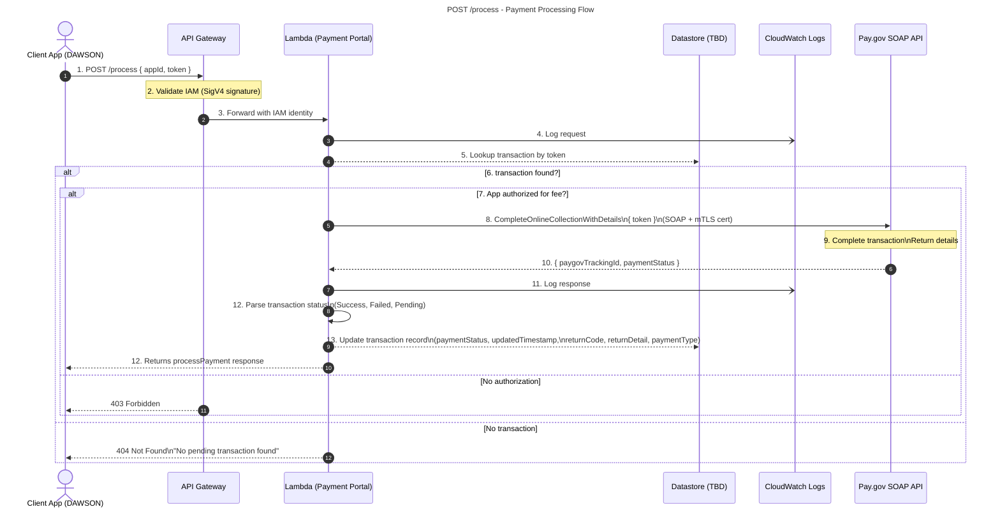

# POST `/process` — Payment Processing Flow

This document describes how the **Client App (DAWSON)** triggers payment completion after a user submits payment information to Pay.gov. The **Payment Portal Lambda** verifies the request, validates authorization, pulls the associated transaction by token, calls **Pay.gov CompleteOnlineCollectionWithDetails**, updates the transaction record, and returns updated payment status to the client.

***

## Overview

*   The user completes (or abandons) payment **in Pay.gov’s UI**, which then forwards payment info to the agency.
*   The agency calls **POST `/process`** with the previously returned `token` from the **init** step.
*   API Gateway validates **IAM SigV4**.
*   Lambda:
    *   Logs the request
    *   Loads the transaction by token
    *   Ensures the calling app is authorized for the fee
    *   Calls **Pay.gov CompleteOnlineCollectionWithDetails**
    *   Updates the Datastore with result details
    *   Returns updated status and transaction list back to the client

***

# Sequence Flow (Mermaid)




***

# Request

### Endpoint

    POST /process

### Headers

*   `Authorization`: SigV4 (IAM)
*   `Content-Type`: application/json

### Body

```json
{
  "appId": "DAWSON",
  "token": "<token-from-init>"
}
```

**Important:**\
This endpoint is required **for all payment types**, regardless of method (credit card, ACH, etc.).

***

# End-to-End Behavior

### 1. User completes payment on Pay.gov

After posting to Pay.gov using the redirect URL from `/init`, the user enters their payment details and submits.

### 2. Pay.gov associates payment with the original token

That token is what the agency uses to retrieve payment results.

### 3. Agency calls `/process`

This step retrieves the Pay.gov payment result, finalizes the transaction, and returns canonical details to DAWSON.

***

# Validation

### IAM Signature Validation (API Gateway)

If invalid → **403 Forbidden**.

### Payload Validation

*   `appId` (string) required
*   `token` (string) required

### Transaction Lookup

If no transaction is found for token → **404 Not Found**

```json
{
  "error": "NotFound",
  "message": "No pending transaction found for token"
}
```

***

# Authorization

**Decision: App authorized for fee?**

*   Validates that:
    *   App (DAWSON) has permission for the fee associated with the token
    *   Fee is included in the app’s `AllowedFees`
*   Permissions sourced from client config

If unauthorized → **403 Forbidden**

```json
{
  "error": "Forbidden",
  "message": "App is not authorized for this fee"
}
```

***

# Pay.gov Interaction

### Operation

`CompleteOnlineCollectionWithDetails`

### Transport

SOAP with **mTLS client certificate**

### Response Example

```json
{
  "paygovTrackingId": "12345678",
  "paymentStatus": "Success"   // or Failed or Pending
}
```

***

# Datastore Update

### Fields updated after Pay.gov response:

```json
{
  "paymentStatus": "Success | Failed | Pending",
  "updatedTimestamp": "<timestamp>",
  "returnCode": "<paygov-return-code>",
  "returnDetail": "<paygov-return-detail>",
  "paymentType": "<ACH | CreditCard | ...>"
}
```

A complete transaction log is maintained (for queries via `/details`).

***

# Response (Happy Path)

**HTTP 200**

```json
{
  "paymentStatus": "Success" | "Failed" | "Pending",
  "transactions": [
    { ...transactionRecord1 },
    { ...transactionRecord2 }
  ]
}
```

*   Payment Portal returns **all attempts** belonging to the same `transactionReferenceId`.
*   This is identical to what `/details` returns once processing is done.

***

# Logging

*   **Step 4** — Log inbound `/process` request
*   **Step 11** — Log outbound Pay.gov result
*   Both written to **CloudWatch Logs**

***

# Legend

*   **Solid arrows** → requests
*   **Dashed arrows** → responses
*   **mTLS** → Pay.gov SOAP mutual TLS cert
*   **TBD** → datastore engine still under design
