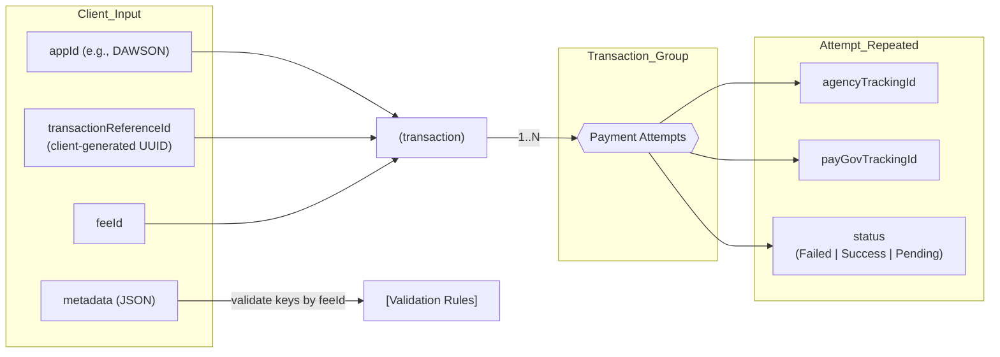

# Unique Identifiers Model — Transactions & Payment Attempts

This document defines the identifiers used by the Payment Portal and how they relate across a **client request**, a **transaction**, and **one or more payment attempts**.

***

## Concepts & Terminology

*   **appId**\
    Identifier for the calling application (e.g., `DAWSON`). Used for authorization and correlation.

*   **transactionReferenceId** (client‑generated UUID)\
    A **client-generated** unique ID that identifies a **single payment interaction** request from the client’s perspective.
    *   Correlates client and Payment Portal records
    *   Supports idempotency on client retries
    *   Enables lookups in `/details`
    *   Represents the **interaction/attempt series**, *not* the underlying obligation

*   **feeId**\
    The code for the fee to be collected (e.g., petitions fee, appeals fee). Authorization rules are applied per client and fee.

*   **transaction**\
    The Payment Portal object that groups **all attempts** for one `(appId, transactionReferenceId, feeId)` request.

*   **agencyTrackingId** (per **attempt**)\
    A new identifier created by the Payment Portal **for each payment attempt**. Used internally and for agency tracking.

*   **payGovTrackingId** (per **attempt**)\
    A new identifier returned/associated by **Pay.gov** **for each payment attempt**.

*   **status** (per **attempt**)\
    One of **`Failed` | `Success` | `Pending`**.

*   **metadata**\
    A flexible JSON structure with key/value pairs describing context for the payment (e.g., `docketNumber`, `petitionNumber`).
    *   **Validated only against the expected keys for a given `feeId`** (shape varies by fee).

***

## Relationship Overview (Mermaid)




***

## Cardinality & Lifecycle

*   **One** `(appId, transactionReferenceId, feeId)` → **One transaction**
*   **One transaction** → **N payment attempts** (until **Success** or **Cancel**)
*   **Each attempt** generates **a new `agencyTrackingId` and a new `payGovTrackingId`**

**Example retry scenarios:**

    Attempt 1: Failed
    Attempt 2: Wrong CVV
    Attempt 3: Success ✓

> **NOTE:** **1 client fee → 1 transaction → N attempts** until canceled or successful.

***

## Identifier Generation & Ownership

| Identifier               | Who/Where Generated            | Scope              | Notes                                           |
| ------------------------ | ------------------------------ | ------------------ | ----------------------------------------------- |
| `appId`                  | Client / Registry              | Client application | Used in auth & routing                          |
| `transactionReferenceId` | **Client** (UUID)              | **Transaction**    | Correlates client ↔ portal; enables idempotency |
| `feeId`                  | Client (agrees on fee catalog) | Transaction/Policy | Checked against **AllowedFees** for the client  |
| `agencyTrackingId`       | Payment Portal (per attempt)   | **Attempt**        | New value per attempt                           |
| `payGovTrackingId`       | Pay.gov (per attempt)          | **Attempt**        | New value per attempt                           |
| `status`                 | Pay.gov → Portal mapping       | **Attempt**        | `Failed` · `Success` · `Pending`                |

***

## Metadata

**Purpose:** provide business context for the payment.\
**Shape:** varies by `feeId`.\
**Validation rule:** **Validate only the keys expected for the given `feeId`** (not a global schema).

**Example** (from your diagram):

```json
{
  "docketNumber": "123456",
  "petitionNumber": "PET-7890"
}
```

**Validation guidance:**

*   Maintain a fee‑to‑schema map (expected keys and optional constraints).
*   Reject unknown keys **only if** that’s part of policy for the given fee.
*   Store metadata as provided (after validation) to support later retrieval and auditing.

***

## Example Payloads & Mappings

### Example — Init request (client → portal)

```json
{
  "appId": "DAWSON",
  "transactionReferenceId": "550e8400-e29b-41d4-a716-446655440000",
  "feeId": "FEE_CODE",
  "urlSuccess": "https://client.app/success",
  "urlCancel": "https://client.app/cancel",
  "metadata": {
    "docketNumber": "123456",
    "petitionNumber": "PET-7890"
  }
}
```

### Example — Attempt record (portal)

```json
{
  "transactionReferenceId": "550e8400-e29b-41d4-a716-446655440000",
  "appId": "DAWSON",
  "feeId": "FEE_CODE",
  "attemptNumber": 2,
  "agencyTrackingId": "AGY-20250218-0002",
  "payGovTrackingId": "PG-987654321",
  "status": "Pending",
  "createdAt": "2025-02-18T20:41:12Z",
  "metadata": {
    "docketNumber": "123456",
    "petitionNumber": "PET-7890"
  }
}
```

***

## Authorization Touchpoint (Cross‑Link)

Before processing a transaction or attempt, the Payment Portal **verifies the app is authorized for the fee**.

*   Query **client permissions** using the caller IAM principal/role ARN
*   Validate that `feeId ∈ AllowedFees` for that app/client
*   If not authorized → **403 Forbidden**

See: **Authentication & Authorization Flow** (cross‑account IAM, allowed fees list).

***

## Status Semantics

*   **Pending**\
    Attempt has been created/handshaked but the final outcome is not yet known.

*   **Success**\
    Attempt completed successfully; the transaction can be considered **Complete** overall.

*   **Failed**\
    Attempt failed. The client may retry (resulting in a new attempt with new tracking IDs).

> Downstream APIs (e.g., `/details`) aggregate attempts and summarize **overall `paymentStatus`**.

***

## Design Notes

*   **Idempotency**\
    Use `transactionReferenceId` to detect client retries. Decide whether to return the **most recent attempt** or create a **new attempt** based on business rules for your fee.

*   **Observability**\
    Include all IDs in logs (correlated by `transactionReferenceId` and `agencyTrackingId`), but avoid logging sensitive PAN/PII.

*   **Discoverability**\
    Provide search endpoints on `transactionReferenceId`, `payGovTrackingId`, and possibly `agencyTrackingId`.

***

## Quick FAQ

**Q: Why does each attempt need new tracking IDs?**\
A: Because each submission to Pay.gov is a distinct operation with its own lifecycle; new `agencyTrackingId` and `payGovTrackingId` keep audit trails accurate and avoid ambiguity across retries.

**Q: Is `transactionReferenceId` unique globally?**\
A: It should be **globally unique** (UUID recommended) and **client‑generated**, so the client can correlate requests and ensure idempotency.

**Q: Where is `status` stored—transaction or attempt?**\
A: **Attempt level**. The transaction’s “overall” status is typically derived from its attempts (e.g., any `Success` → overall **Success**; all `Failed` and no pending → overall **Failed**; otherwise **Pending**).

***

## At‑a‑Glance Summary (from the diagram)

*   Inputs: **appId**, **transactionReferenceId (client)**, **feeId**, **metadata**
*   Transaction node groups **N attempts**
*   Each attempt has: **agencyTrackingId**, **payGovTrackingId**, **status**
*   Status values: **Failed | Success | Pending**
*   **Rule:** *1 client fee → 1 transaction → N attempts (until cancel or success)*
